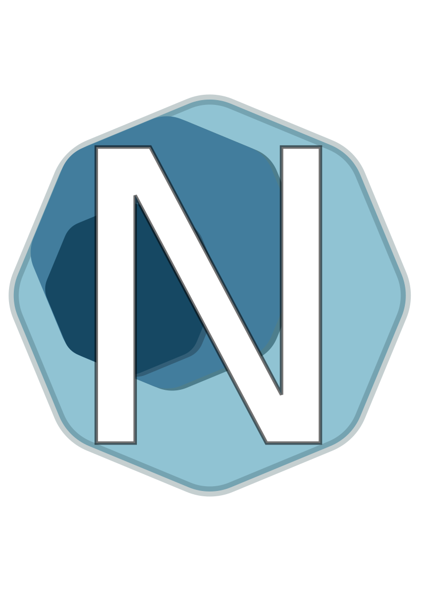

# Niv




Niv is a fairly simple interpreted langauge written in Rust, being the unofficial spritiual succesor of [Glang](https://github.com/BlidDev/Glang).

The main goal behind this project was to make a language capable of ed expressions (like `printf("%d\n", 1 + 1)` for example).

If you want to learn more about the development of this langauge check out the [video](https://youtu.be/ev20-C2jOPc) I made about the process.

## Wiki
Niv holds a detailed wiki about almost every aspect of language, check these two pages out to get started:
* [Installation](https://github.com/BlidDev/Niv/wiki/installation)
* [Setting up and running your first project](https://github.com/BlidDev/Niv/wiki/first_project)

Other pages can be found over in the [wiki](https://github.com/BlidDev/Niv/wiki) tab.

## Code example:
Here is an example code sinppet that prints your info using sturcts:

```Python

@Person
 name : ""
 age : 0
@Person

#MAIN |
    set name (input "Enter your name: ")
    set age (inputcast i32 "Enter your age: ")
    set obj (make Person $name $age)
    print "Your info is: {}\n" $obj
#MAIN
```

### Libraries used for this project
* `unescape`
* `snailquote`
* `unstringify` 
* `sfml-rs`
* `device_query`
* `clap`

___
## Special Thanks
Thanks a bunch for 
* [Badduck](https://www.youtube.com/@Badduck)
* [AstroSam](https://www.youtube.com/@AstroSamDev)
* [Dorbell](https://www.youtube.com/@Dorbellprod)

For helping throughout the project in many forms and again for [Dorbell](https://www.youtube.com/@Dorbellprod) going over and refining the Niv wiki.

___
Thanks for checking out Niv! :D
